# visualize_NNs_VC_

A toy project for visualizing and diagnosing neural networks. Every script
is standalone (drag-and-drop, lazy heavy imports) and falls into one of two
families:

1. **[ZFNet-style diagnostics](#1-zfnet-style-cnn-diagnostics)** — Zeiler &
   Fergus (2014) deconvnet reconstruction, occlusion sensitivity, and
   saliency/guided backprop, adapted from an ImageNet classifier to an RL
   policy/value network (`zf_viz.py`, `visualize_cnn_diagnostics.py`).
2. **[`visualtorch` architecture renders](#2-visualtorch-architecture-diagrams)**
   — draw a model's module graph as an image (`visualize_PPO_model.py`,
   `visualize_gemma_model.py`, `visualize_qwen_moe_model.py`).

Both families were originally written against
`vizdoom_clone_project_vibecoded`'s PPO `CnnPolicy` (a `NatureCNN` — three
strided `Conv2d`+`ReLU` pairs, no pooling — feeding policy/value heads); the
transformer scripts extend the architecture-render idea to HuggingFace
`transformers` models. See `CLAUDE.md` for the full architecture notes and
`README_zf_viz.md` for `zf_viz.py`'s complete flag reference.

---

## 1. ZFNet-style CNN diagnostics

| Paper section | Technique | What it answers here |
|---|---|---|
| §2.1 (Fig. 1, 2, 4) | **Deconvnet** | "What input pattern caused this feature-map channel to fire?" Reconstructs a chosen conv-layer channel's activation back to pixel space. |
| §4.2 (Fig. 6) | **Occlusion sensitivity** | "Which part of the screen is the agent actually using?" Slides a gray patch over the frame and tracks how much each action's probability / the value estimate drops. |
| — (not in paper) | **Saliency / guided backprop** | Gradient-based alternative to deconvnet — a cheaper cross-check on a network this shallow. |

"Class probability" in the paper becomes **action probability** (policy
head) and **value estimate** (critic head), since this is an RL
policy/value network, not a softmax classifier. The target `NatureCNN` has
no max-pooling, so the paper's per-layer "unpool → rectify → filter"
collapses to "rectify → filter" throughout.

Renders below are from a trained PPO agent on `basic.wad`:

<table>
<tr>
<td align="center">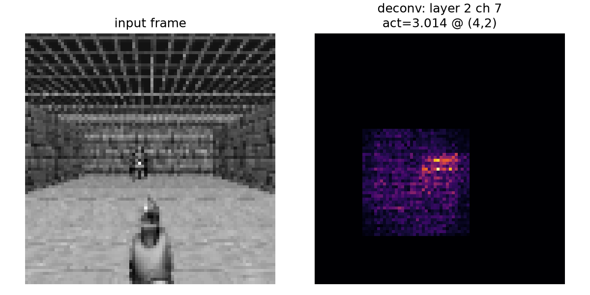<br><sub>Deconvnet reconstruction</sub></td>
<td align="center">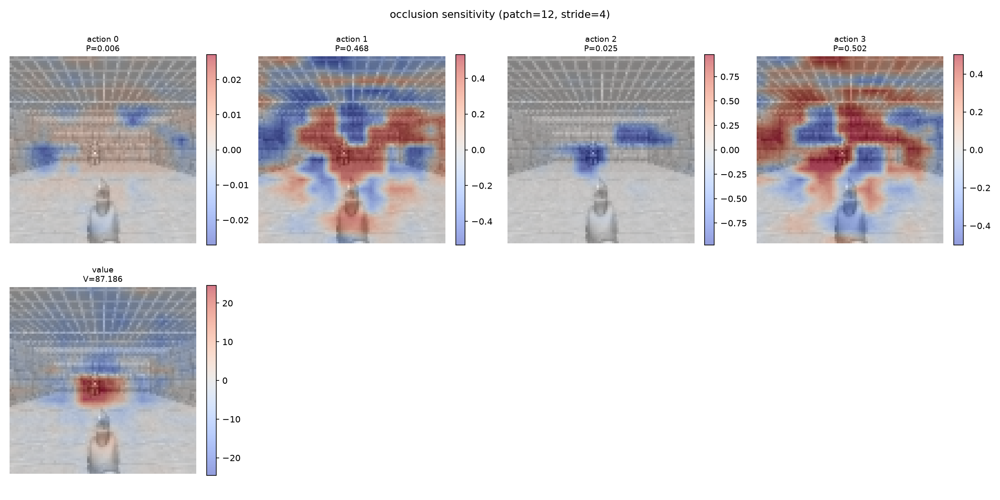<br><sub>Occlusion sensitivity</sub></td>
</tr>
<tr>
<td align="center">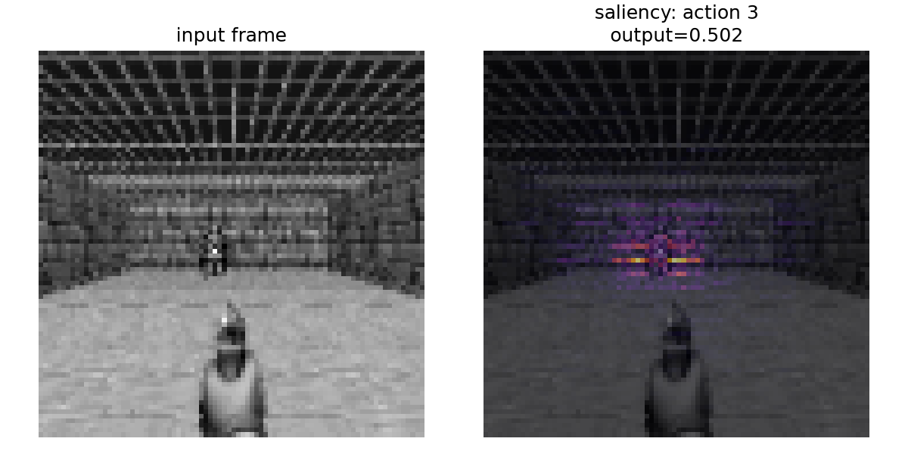<br><sub>Vanilla saliency</sub></td>
<td align="center">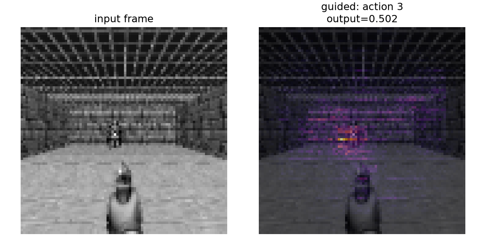<br><sub>Guided backprop</sub></td>
</tr>
</table>

```
python zf_viz.py --technique all                                     # shape sanity-check, no model needed
python visualize_cnn_diagnostics.py --model models/latest/ppo_basic.zip --env basic --technique all
```

## 2. `visualtorch` architecture diagrams

Each script wraps its target model (or one representative sub-module) so
`forward()` takes a single tensor in and returns a single tensor out, then
renders the module graph with [`visualtorch`](https://github.com/willnx/visualtorch).

### PPO `CnnPolicy` (NatureCNN → action head)

The original of the three; renders the actor branch used by the ZFNet
diagnostics above.

<table>
<tr>
<td align="center">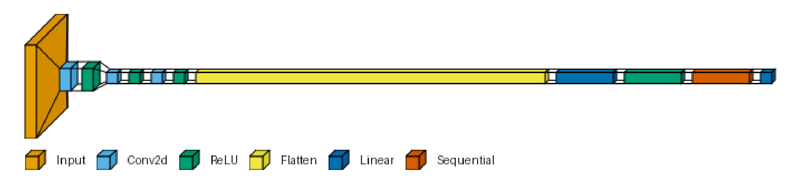<br><sub>basic.wad (Discrete(3))</sub></td>
<td align="center"><br><sub>deadly_corridor.wad</sub></td>
</tr>
</table>

```
python visualize_PPO_model.py --model models/latest/ppo_basic.zip --style flow
```

### Gemma 3n E4B (text decoder)

An untrained `Gemma3nTextModel` built from `transformers`' config — no
download or real weights needed. The full 35-layer E4B backbone
instantiates and runs a forward pass fine, but `visualtorch` OOMs trying to
render that many unrolled skip-connections (AltUp ×4, LAuReL, per-layer
inputs), so the default scope is **one decoder layer**; `--tiny` shrinks
width/depth enough to render the full backbone instead.

<table>
<tr>
<td align="center">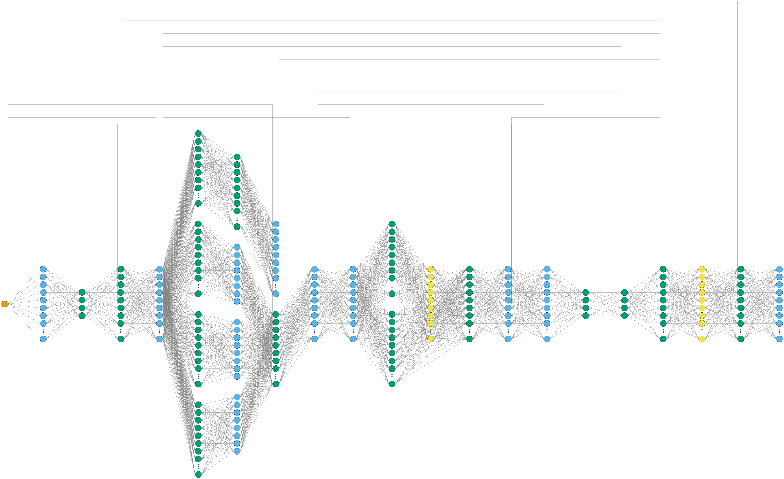<br><sub>One E4B decoder layer (graph style)</sub></td>
<td align="center">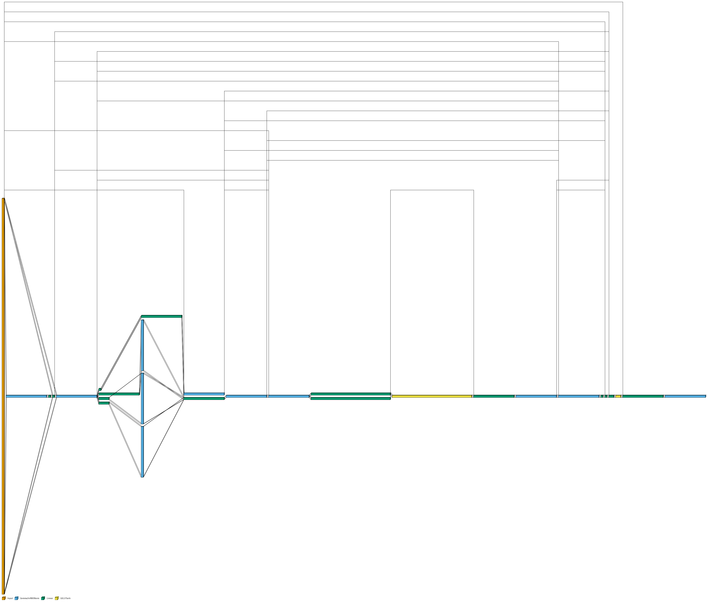<br><sub>One E4B decoder layer (flow style)</sub></td>
</tr>
<tr>
<td colspan="2" align="center"><br><sub>Full backbone, shrunk to 2 layers (--tiny)</sub></td>
</tr>
</table>

```
python visualize_gemma_model.py --style graph                # one decoder layer (default)
python visualize_gemma_model.py --scope backbone --tiny       # full depth, shrunk width
```

### Qwen3-MoE (decoder layer)

Same recipe applied to a `Qwen3MoeDecoderLayer`. In this `transformers`
version the MoE block (`gate` + `experts`) stores every expert's weights as
raw `nn.Parameter` tensors sliced with `F.linear` rather than per-expert
submodules, so `visualtorch` always draws exactly two leaf nodes for the
whole MoE block — regardless of expert count (8 in the reduced config below,
128 with `--real`).

<table>
<tr>
<td align="center">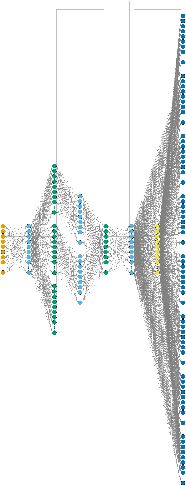<br><sub>One real-dims layer (128 experts, top-8)</sub></td>
<td align="center">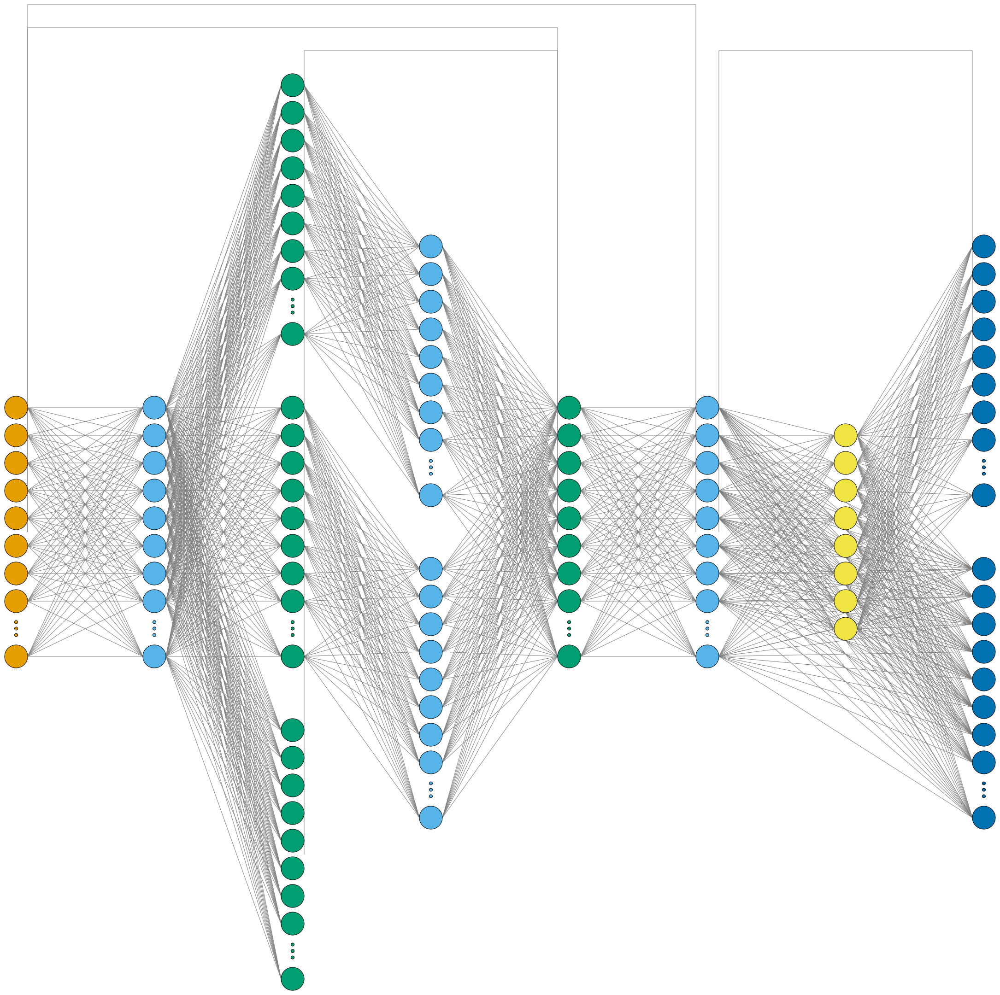<br><sub>One reduced-config layer</sub></td>
</tr>
<tr>
<td align="center">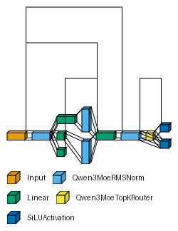<br><sub>Reduced-config layer (flow style)</sub></td>
<td align="center">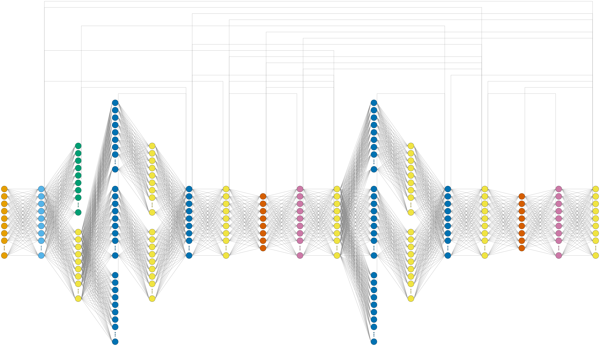<br><sub>Reduced backbone (2 layers)</sub></td>
</tr>
</table>

```
python visualize_qwen_moe_model.py --style graph              # reduced config, one layer (default)
python visualize_qwen_moe_model.py --real --style graph       # true Qwen3-MoE dims
```

### Known `visualtorch` (1.2.1) limitations these scripts work around

- No way to pass an explicit input tensor — only `input_shape`, which is
  filled with `torch.rand()` (floats). Token-ID models derive valid ids from
  the traced float tensor instead: `input_ids = (x * 0).long() + k`.
- Render styles are `graph` / `flow` / `lenet` (no `layered`). `graph` is
  the only legible style for transformers; `flow` suits the CNN case.
- Full transformer backbones trace and run fine but blow up PIL's canvas
  allocation on render — hence rendering one representative layer instead.

---

## Requirements

Every script needs only `torch` (plus `numpy`/`matplotlib` for the ZFNet
family) for its zero-argument / untrained-model path. Loading a real PPO
model or a live ViZDoom frame additionally needs `stable-baselines3`,
`gymnasium`, and `vizdoom`; the transformer renders additionally need
`transformers`. All of these are imported lazily, only where needed, and
are expected to come from the sibling `vizdoom_clone_project_vibecoded`
project's virtualenv rather than one in this repo.

See `CLAUDE.md` for the full internal architecture of each script family.
